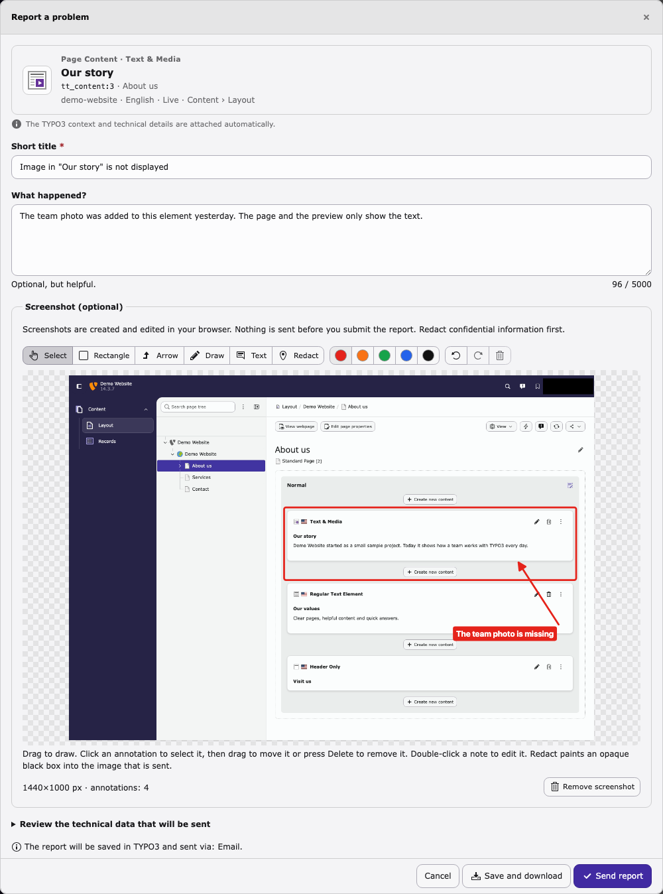
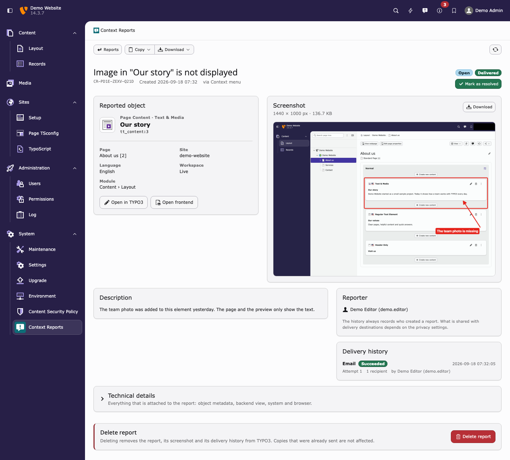

# TYPO3 Context Reporter


Object-aware problem reports for the TYPO3 backend.

Editors report a problem where it happens. The report automatically carries
the TYPO3 context a developer or support team needs: the page, record and
content type, file or folder, site, language, workspace and backend module,
plus the TYPO3, PHP and browser versions. An optional screenshot is annotated
and redacted in the editor's browser.

> The screenshot shows what the user sees. The TYPO3 context tells the
> developer what the problem actually belongs to.

Context Reporter is **not a ticket system**. Reports are downloaded, emailed
or sent to a webhook, so they end up in the tools your team already uses. The
local report history is an audit log with an open/resolved marker, not a
workflow.

[Product website](https://typo3.priebera.sk/context-reporter) ·
[Documentation](Documentation/Index.rst) ·
[Issues](https://github.com/priebera1/typo3-context-reporter/issues) ·
[Security](SECURITY.md) ·
[Support](SUPPORT.md)



## Features

- **Report where the problem is:** backend toolbar, context menu of pages, records, files and folders, record list, Page module, file list and the record editing form.
- **Object-aware context:** page, record and content type, editing form, file, folder and storage, site, language, workspace, backend module, system and browser. Only allowlisted metadata is collected, and the dialog shows everything before it is sent.
- **Screenshots, edited locally:** screen capture, upload or paste; rectangle, arrow, freehand, text and opaque redaction. Annotations are flattened before upload.
- **Delivery:** email through the TYPO3 mail API, a signed webhook (HMAC-SHA256) for n8n, Make, Zapier or your own API, and downloads as JSON or Markdown.
- **Report history:** System › Context Reports with filters, open/resolved state, delivery history, manual retry, Copy (summary, Markdown, JSON, link) and Download.
- **Settings, privacy and retention:** configurable reporter identity and browser details, reports kept forever by default or cleaned up after a number of days (also on the command line).
- **English and German** backend labels.



## Supported versions

| Context Reporter | TYPO3 | PHP |
| --- | --- | --- |
| 0.1 | 13.4 LTS, 14.3 | 8.2, 8.3, 8.4 |

Tested with MariaDB 10.11, MySQL 8.0 and SQLite. Composer mode is the tested
and recommended installation method; classic mode (Extension Manager) has not
been verified yet.

## Installation

```bash
composer require priebera/typo3-context-reporter
vendor/bin/typo3 extension:setup
```

## Quick start

1. Open **System › Context Reports** and click **Settings** (top right).
2. Configure email or webhook delivery, check the status panel and send a test email or test webhook.
3. Click **Report a problem** in the backend toolbar and send a first report.

Without a destination, reports are stored in the report history and can be
downloaded. See the [documentation](Documentation/Index.rst) for all settings,
the email markers, the webhook protocol with signature verification, storage
and retention, permissions and troubleshooting.

## Privacy and security

- Collectors read an allowlist of metadata. They do not read record field values (apart from the record label), form contents, cookies, sessions, HTTP headers, credentials or environment variables.
- Reports only reference pages, records, files and folders the reporter can access, including file mounts and the current workspace.
- Secrets are write-only in the settings, and error messages, ticket references and log entries are sanitized.
- Screenshots and reports stay in your TYPO3 database and go only to the destinations you configure.
- Administrators are trusted with the webhook destination; the documentation explains how to pin it.

Report security issues privately, see [SECURITY.md](SECURITY.md).

## Contributing

Development setup, tests and conventions are described in
[CONTRIBUTING.md](CONTRIBUTING.md).

## License

GPL-2.0-or-later. See [LICENSE.txt](LICENSE.txt).

The screenshot editor bundles [Konva](https://konvajs.org/) 10.5.0 (MIT),
see `Resources/Public/JavaScript/contrib/konva.LICENSE.txt`.
